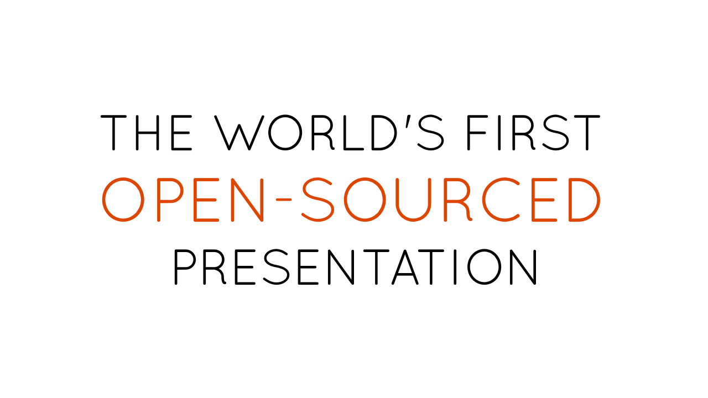
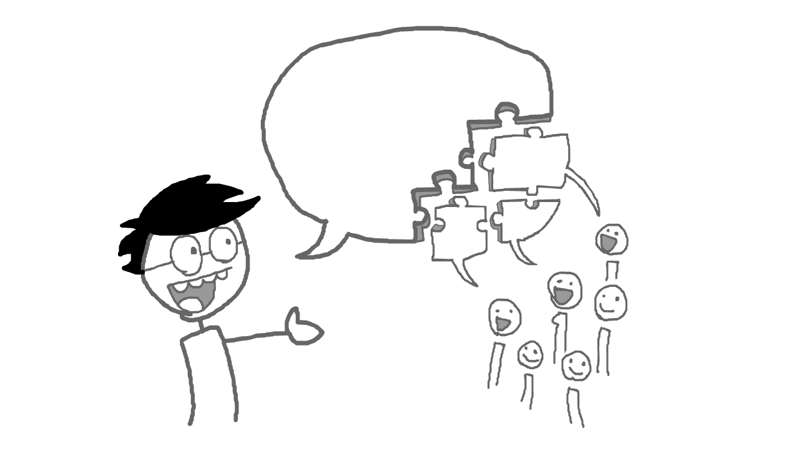
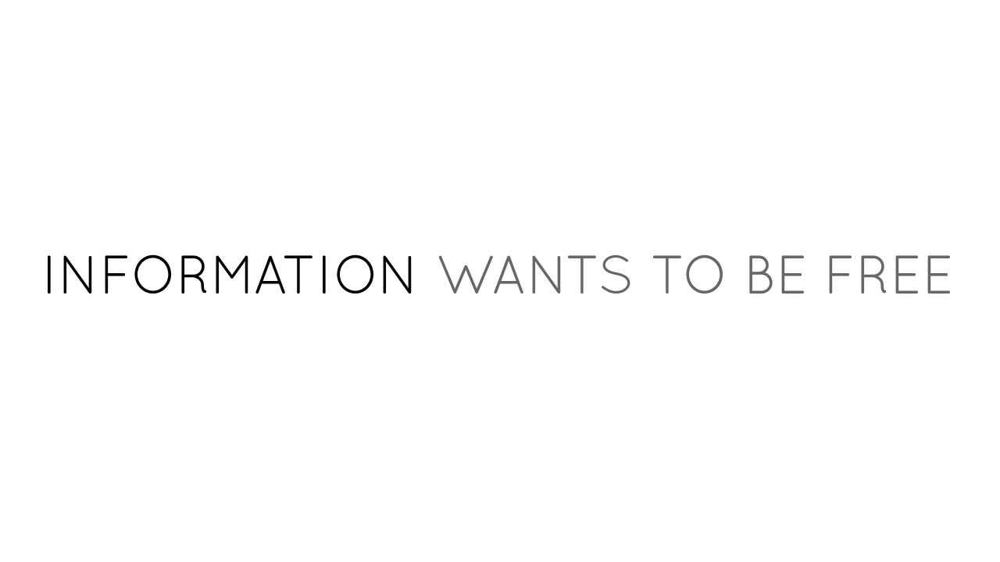
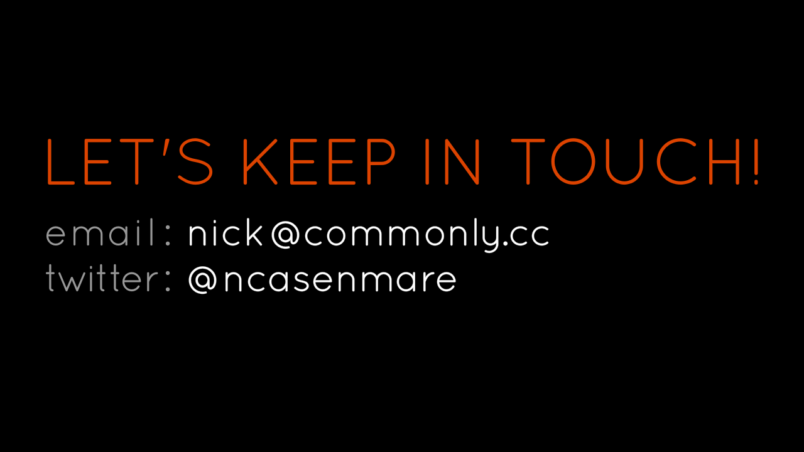

sxsw-talk
=========

The World's First Open-Sourced Presentation

Welcome to the world's first open-sourced presentation.

All my notes and slides are available online under a Creative Commons license.
Allowing anyone to remix this talk.

I invited my fans and followers to contribute to this presentation. 

I wanted my talk to have their voice.
I wanted my talk to show the good in openness.

---

Openness versus Business.

Openness is about letting others build upon your work.
Business helps ensure people are rewarded for their work.

Openness and Business are both good, and both can be forces for good.
But most of the time, they are at odds.

. . .

Some businesses today, in both media and technology, are actively hurting openness.

For example, Disney, one of the world's biggest media conglomerates.
In 1998, they successfully lobbied to extend the term of copyright to 70 years after the creator's death.
People call the bill that was passed, The Mickey Mouse Protection Act.

Or Apple, one of the biggest players in the tech industry today.
They're notorious for their control-freak attitude towards their own users and developers.
People call unlocking their iDevices, Jailbreaking.

. . .

But business isn't always opposed to openness. Many great businesses have been built upon open works.

Such as, ironically, Disney. One of the most loved family brands in the world.
Their early films, such as Snow White and Alice in Wonderland, were adaptations of public domain novels.
Stories which stood the test of time.

Or Apple, the company that Thought Different and sparked the personal computer revolution.
Mac OS runs off the open-source Unix, and Safari uses the open-source Webkit. // Apple CREATED Webkit
Software which stood the test of time.

. . .

Openness and Business.

You could say it's a love-hate relationship. Best Frenemies Forever.
They could work great together, but right now, there's just too much... tension.

---

Information Wants To Be Free

You may have heard this phrase before, "Information wants to be free".
It's actually part of a bigger quote, which is:

Information wants to be free.
Information also wants to be expensive.
That tension will not go away.

It's paradoxical, but here's how something can be both free and expensive.
Think about a typical product timeline.

We have two main stages:
Development, where we figure out what to make and how.
Then, Distribution, where we make copies to sell to the world.

// Edit to fit the slide.
However - for information goods, such as digital media or software, distribution is free.
From recorders to photocopiers to 3D printers, making copies is easier than ever.
But development is expensive. And it's getting more expensive.
It's commonplace for games and software to take years of work and millions of dollars.

What's costly is development, but we sell distribution.
That is the source of all the tension.

What costs money, development, is not what makes money, distribution.

---

Here's where things go from bad to worse.
Our society has tried to resolve this tension by doing this:

Making Distribution Artificially Expensive.
Making distribution cost money, just so it's possible to make money.

We create this artificial cost through three ways:

1) The legal system, with copyrights and patents.
Intellectual property has grown out of control, and is ironically stifling innovation.
Now we have patent trolls, and invasive bills such as SOPA, PIPA, ACTA, CISPA, etc.

2) Technology, with DRM and closed platforms.
It's ineffective at stopping pirates, and it's insulting to legitimate users.
We don't own the digital files we paid for - we're just renting them.

3) Business, with walled gardens and lock-in.
We're locked into their services, with our data on their servers.
From their central servers, we get spied on by advertisers and agencies.

What costs money is not what makes money.
That tension will not go away.
Unless.

Unless.
Instead of making distribution artificially expensive,
what if we made development actually profitable?

Yes, what if you made money off doing what is actually valuable? Shocking idea, I know.
But allow me to give a few examples of how people are already making money by making open works.

---

Let's go back to the product timeline.

// Briefly mention selling external services and donations?

Breaking the timeline up further, we find three stages of Development:
The Concept, the Creation, and the Release.

Let's explore how people are monetizing open works at each of these three stages.
 

**Starting with: The Concept**

Normally, when someone needs money at the concept phase, they look for funding. It's a familiar economic concept.
So if someone makes something for the public, for the crowd, they could use crowdfunding.

// Ghost. Just Ghost.

**Alternatively, you could crowdfund: The Creation**

Another familiar economic concept is the salary.
But instead of a salary paid by a company, how about a salary sponsored by one's fans?
You heard it here first - "crowdsalary".

Just last month, someone launched an exciting take on the "crowdsalary":
VlogBrothers, two famous Youtubers _____+ let people pledge monthly subscriptions to their educational animated series, Crash Course.
Currently, they've raised $60000 per month in subscriptions.
Not $60k in total, $60k per month.

**And finally: The Release**

This is just right before you send your digital work off into the wild.
As soon as you release a digital file, there will be pirated copies.
But no one can make a single copy until that Release.

This is also known as The Ransom Publishing Model.
An example in art: The Open Game Art Bundle, which [disclosure] I organized. It was a collection of video game spritesheets and soundtracks that we put up for a ransom of $10,000. In three weeks, we earned $12,000 from 700+ buyers. And in exchange, the whole bundle is now available under a public domain license.

// . .sdasdsadasd
// Not just one way, a whole family of methods.

---

// Mini-call to action
// Self reference to slides - combine with site & twitter?

Technology may have increased the tension between openness and business,
but hopefully I've shown that one day, technology will help merge openness and business together.

The World's First Open-Sourced Economy

//We can do well by doing good.
// Mini call to actions
// Tie into the open-source presentation
// LET ME HELP YOU

Thank you!
[Contact Info: @Twitter & Website]

